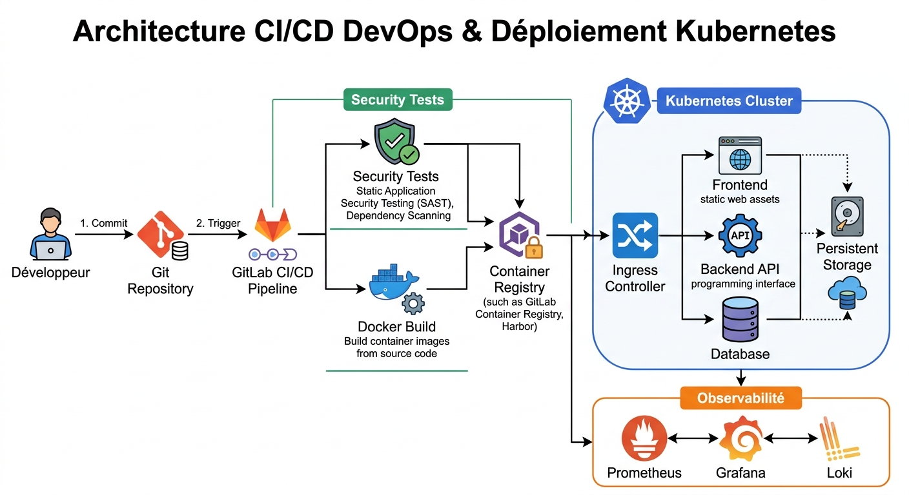

# ☸️ Kubernetes DevSecOps Platform

## Conception et mise en place d'une plateforme Kubernetes DevSecOps pour le déploiement sécurisé d'applications Full Stack

## 📌 Présentation du projet

Ce projet consiste à concevoir et mettre en place une plateforme Kubernetes DevSecOps permettant le déploiement, l'automatisation et la supervision d'applications Full Stack dans un environnement proche des contraintes rencontrées en entreprise.

L'objectif est de construire une chaîne complète intégrant l'infrastructure, l'orchestration des conteneurs, l'automatisation CI/CD, la sécurité applicative et l'observabilité.

Ce projet a été réalisé dans le cadre de mise en place d'une cluster kubernetes On-promise pour Une Université.

---

# 🎯 Objectifs du projet

Les objectifs principaux de cette plateforme sont :

- Concevoir une infrastructure Kubernetes complète
- Mettre en place un cluster Kubernetes avec kubeadm
- Déployer une application Full Stack conteneurisée
- Automatiser le cycle de livraison avec une pipeline CI/CD
- Intégrer la sécurité dans le cycle de développement (DevSecOps)
- Mettre en place une solution d'observabilité
- Appliquer des stratégies de déploiement adaptées aux environnements de production

---

# 🏗️ Architecture globale

La plateforme est organisée autour de plusieurs couches :

## Couche Infrastructure

Cette couche constitue la base de la plateforme :

- Proxmox VE
- Machines virtuelles Linux
- Réseau interne
- Stockage persistant

## Couche Conteneurisation

Gestion des applications conteneurisées :

- Docker

## Couche Orchestration

Gestion du déploiement et de l'exploitation des applications :

- Kubernetes
- kubeadm

## Couche Application

Déploiement d'une application Full Stack composée de :

- Frontend
- Backend API
- Base de données

## Couche DevSecOps

Automatisation et sécurisation du cycle de livraison :

- GitLab CI/CD
- Trivy
- Semgrep

## Couche Observabilité

Collecte et analyse des données de supervision :

- Prometheus
- Grafana
- Loki

---

# 🛠️ Stack technique

| Domaine | Technologies |
|---|---|
| Virtualisation | Proxmox VE |
| Système | Linux |
| Conteneurisation | Docker |
| Orchestration | Kubernetes |
| Installation cluster | kubeadm |
| CI/CD | GitLab CI/CD |
| Registry | GitLab Container Registry |
| Sécurité | RBAC, Trivy, Semgrep |
| Stockage | NFS, Persistent Volumes |
| Monitoring | Prometheus, Grafana |
| Logging | Loki |

---

# 📂 Organisation du repository

Le repository est structuré suivant les différentes étapes de construction de la plateforme.

kubernetes-devsecops-platform/

├── 00-cluster-infra/
│ → Mise en place de l'infrastructure Kubernetes

├── 01-namespaces/
│ → isolation et gestion des accès

├── 10-applications/
│ → Déploiement des applications Full Stack

├── ci/
│ → Pipeline CI/CD et intégration des contrôles de sécurité

├── deployment-strategies/
│ → Stratégies de déploiement Kubernetes

├── observability/
│ → Monitoring et centralisation des logs

├── docs/
│ → Documentation, architectures et schémas

├── Makefile
│ → Automatisation des opérations courantes

└── cleanup-insi.sh
→ Nettoyage des ressources Kubernetes

---

# 🚀 Étapes de réalisation

## Phase 1 — Conception de la plateforme

Cette phase présente la vision globale du projet :

- Analyse des besoins
- Choix d'architecture
- Sélection des technologies
- Conception des schémas d'infrastructure

## Phase 2 — Mise en place du cluster Kubernetes

Construction de l'environnement Kubernetes :

- Création des machines virtuelles
- Préparation des systèmes Linux
- Installation du container runtime
- Installation de Kubernetes avec kubeadm
- Configuration du control-plane
- Ajout des nœuds workers
- Validation du cluster

## Phase 3 — Déploiement de l'application Full Stack

Déploiement des composants applicatifs :

- Création des manifests Kubernetes
- Configuration des Deployments
- Création des Services
- Gestion des ConfigMaps et Secrets
- Mise en place du stockage persistant
- Mise en place des controle d'accés basé sur les roles (RBAC) 
- Mise en place de la scalabilité Horizontal (HPA) et le zero dowtime
- Exposition des applications

## Phase 4 — Mise en place de la chaîne DevSecOps CI/CD

Automatisation du cycle de livraison :

- Création des pipelines GitLab CI/CD
- Construction des images Docker
- Publication dans un registry
- Analyse de sécurité avec Trivy
- Analyse du code avec Semgrep
- Déploiement automatisé dans Kubernetes

## Phase 5 — Stratégies de déploiement avancées

Mise en œuvre de pratiques utilisées en production :

- Rolling Update
- Rollback
- Blue/Green Deployment
- Canary Deployment

## Phase 6 — Observabilité de la plateforme

Mise en place d'une solution d'observabilité :

- Collecte des métriques avec Prometheus
- Création de tableaux de bord Grafana
- Centralisation des logs avec Loki
- Suivi de l'état du cluster et des applications

---

# 🔐 Aspects sécurité intégrés

La plateforme intègre plusieurs mécanismes de sécurité :

- Gestion des permissions avec RBAC
- Isolation par namespaces
- Gestion sécurisée des configurations
- Analyse des vulnérabilités des images Docker
- Analyse statique du code source
- Sécurisation du pipeline CI/CD

---

# 📈 Évolution prévue de la plateforme

## Version 1.0 — Kubernetes DevSecOps Foundation

Version actuelle du projet :

✅ Cluster Kubernetes  
✅ Déploiement application Full Stack  
✅ CI/CD DevSecOps  
✅ Monitoring et logging  

---

## Version 2.0 — Infrastructure as Code

Objectif : automatiser la création de l'infrastructure.

Prévisions :

- Terraform
- Modules Terraform
- Provisionnement automatique
- Gestion du cycle de vie infrastructure

---

## Version 3.0 — Configuration Management

Objectif : automatiser la configuration des serveurs.

Prévisions :

- Ansible
- Playbooks
- Rôles
- Automatisation système

---

## Version 4.0 — GitOps Platform

Objectif : adopter une approche GitOps.

Prévisions :

- Argo CD
- Déploiement continu Kubernetes
- Synchronisation automatique
- Self-healing

---

## Version 5.0 — Sécurité avancée Kubernetes

Objectif : renforcer la sécurité de la plateforme.

Prévisions :

- HashiCorp Vault
- Falco
- Kyverno
- Policy as Code
- Supply Chain Security

---

## Version 6.0 — Cloud Native Platform

Objectif : évolution vers un environnement Cloud.

Prévisions :

- AWS
- Kubernetes managé (EKS)
- Architecture Cloud Native
- Infrastructure hybride

---

# 📚 Documentation

Chaque composant de la plateforme possède sa propre documentation dans les dossiers correspondants.

La documentation présente :

- Architecture
- Configuration
- Déploiement
- Tests réalisés
- Résultats obtenus

---

# 👤 Auteur

**Abdourahamane AbdelWahab**

Security Engineer | Network & Infrastructure Security | DevSecOps 

🌐 Portfolio : 
https://abdel-port-folio-nine.vercel.app/

GitHub :
https://github.com/AbdelWahab28

LinkedIn :
https://linkedin.com/in/abdelwahab28